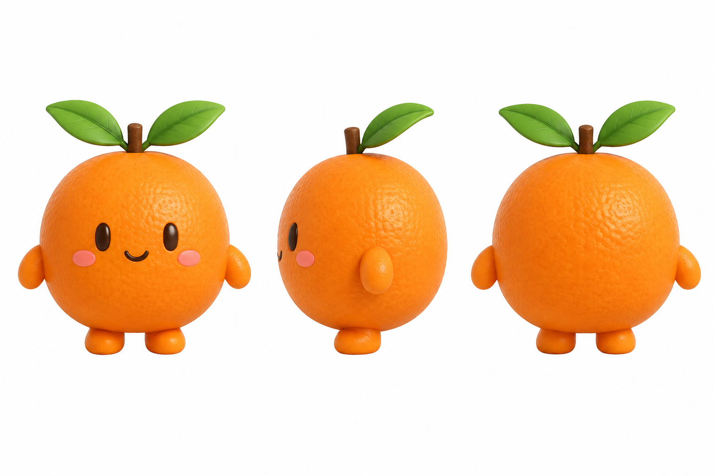
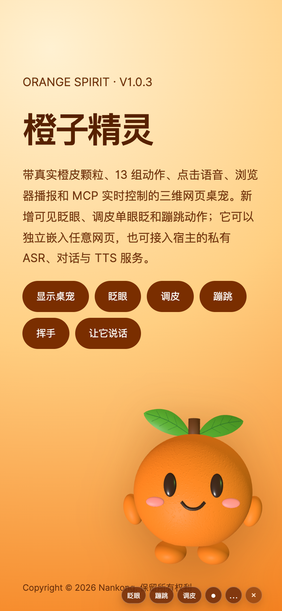

# 橙子精灵网页桌宠 V1.0.3

Copyright © 2026 Nankong. 保留所有权利

## 三视图设计基准



建模严格以仓库内 `assets/reference/orange-spirit-three-view.png` 为依据：橙皮使用离散油胞颗粒法线；双叶具有长椭圆尖叶轮廓、纵向拱度、横向浅杯状曲面、厚度、果梗根部层叠及正反叶脉；双眼闭合时仍保留为深棕细椭圆。

## 手机端截图与演示录屏

<table>
  <tr>
    <td width="34%" align="center" valign="top">
      <strong>手机端运行截图</strong><br><br>
      
    </td>
    <td width="66%" align="center" valign="top">
      <strong>V1.0.3 交互演示录屏</strong><br><br>
      <a href="assets/video/orange-spirit-demo-V1.0.3.mp4">
        
      </a>
      <br><br>
      <a href="assets/video/orange-spirit-demo-V1.0.3.mp4">▶ 点击播放完整 MP4 演示录屏</a>
      <br>
      <sub>H.264 · 960 × 720 · 30fps · 9.97 秒</sub>
    </td>
  </tr>
</table>

## 本地预览

```bash
npm install
npm run dev
```

打开 Vite 根地址可查看包含设计图、手机截图、演示录屏和 Skill 下载入口的介绍页；`/demo.html` 是可操作的桌宠演示。页面支持拖动、隐藏/恢复、眨眼、调皮、蹦跳、文字聊天和点击语音；完整动作也可通过 API 或 MCP 调用。空闲时会在未启用减少动态效果且没有其他一次性动作时自然眨眼，手动眨眼仍可使用。底部只保留六个悬浮按钮，并与角色脚部完全分离。

## Skill：web-3d-pet-generator

下载 `public/downloads/web-3d-pet-generator-skill.zip`，将其中的 `web-3d-pet-generator` 文件夹放入 Codex Skills 目录。新项目从 `references/getting-started.md` 开始，将自己的三视图、角色名、颜色、动作和 GLB 路径写入生产简报与 `web-pet-release.json`。橙子精灵只是完整示例，Skill 的校验器、网页契约、语音边界和 MCP 流程均不绑定具体角色。

Skill 压缩包已经内置完整介绍页、设计图、手机截图和演示录屏。解压后可直接运行：

```bash
python3 web-3d-pet-generator/scripts/preview.py
```

预览页只使用本地静态资源，不依赖原项目、Node.js、CDN 或外部字体；替换 `assets/preview/media/` 和页面文字即可用于新的桌宠。

仓库保留了可直接嵌入网页的 `dist/` 最终构建。修改源码后执行 `npm run build` 更新它；交付 validator 会核对 `assets/`、`public/` 和 `dist/` 三处显式 V1.0.3 运行 GLB 的 SHA-256 及精确 13 动作集合。每个目录只保留一个模型文件，不再同时保存无版本号副本。

## 嵌入网页

```ts
import { createWebPetPlugin, ORANGE_SPIRIT } from './dist/web-pet.js'

const pet = createWebPetPlugin(ORANGE_SPIRIT)
await pet.mount({
  target: document.body,
  assetBaseUrl: 'https://你的静态资源地址',
})

pet.playAction('Mischief')
await pet.speak({ text: '你好，我是橙子精灵！' })
```

远程 HTTPS 页面默认不要连接本机 HTTP 桥；网页插件可完全独立运行。只有从 `localhost` / `127.0.0.1` 打开的本地页面才设置 `bridgeUrl: 'http://127.0.0.1:8765'`。浏览器支持 Web Speech Recognition 时可直接点击录音；宿主也可以注入私有 `transcribe/chat/synthesize` 适配器，密钥只留在宿主后端。

## MCP

```bash
cd mcp
npm install
npm run build
node build/server.js
```

将 `mcp/orange-spirit.mcp.json` 的占位绝对路径改为本机 `mcp/build/server.js`。MCP 使用 stdio；网页命令桥只监听 `127.0.0.1:8765`。

`orange_pet_play_action` 接受 13 个 GLB 动作名：`Idle`、`Blink`、`Listen`、`Think`、`Speak`、`Wave`、`Celebrate`、`Error`、`Sleep`、`Bounce`、`Spin`、`Shy`、`Mischief`。`Blink`、`Mischief` 与 `Bounce` 为一次性动作，完成后会恢复 `Idle`。

## 验证

```bash
npm run build
npm test
npm run orange:model:validate
python3 skill/web-3d-pet-generator/scripts/validate_delivery.py .
npm --prefix mcp test
npm --prefix mcp run build
npm --prefix mcp run test:protocol
```

`npm test` 的 `pretest` 会先运行生产构建。完整的已验证指标、哈希和环境边界见 `docs/FINAL_QA.md`。

本仓库是 V1.0.3 最终快照，只保留最新设计图、模型、源码、运行包、介绍页、手机截图、演示录屏、验证材料和通用生成 Skill，不包含旧版本或修改过程。
